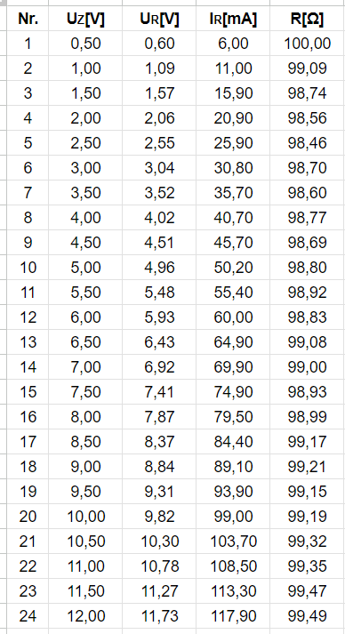

# Author: Narothe

### Purpose of the exercise:
1. To check Ohm's law.
2. To determine the temperature of the filament of the bulb.

### Course of the exercise:
1. Assemble a circuit consisting of a resistor, an ammeter (200 mA range), and a voltmeter (20 V range).
2. Vary the voltage U (0 - 6 V) and read the intensity I. Make an accurate note of ΔU and ΔI.
3. Change the resistor to an incandescent bulb and carry out analogous measurements.
4. Read the ambient temperature t0.

### Input data:
1. Alpha value:  

2. Ambient temperature:  

3. Resistance of the resistor / bulb:  

### Required physical formulas:
1. Average resistance:  

2. Temperature calculation:  

3. Resistance calculation:  

 
Testing of the resistor Rt = 100 Ω ± 10 Ω 

Where:  
Uz - bulb voltage [V]  
Ur - resistor voltage [V]  
Ir - resistor current [A]  
R - electrical resistance [Ω]  

 
The original text was in Polish. The task was translated using online translators.