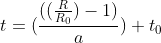
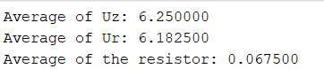

# Author of the solution: Narothe

### Purpose of the exercise:
1. To check Ohm's law.
2. To determine the temperature of the filament of the bulb.

<br>

### Course of the exercise:
1. Assemble a circuit consisting of a resistor, an ammeter (200 mA range), and a voltmeter (20 V range).
2. Vary the voltage U (0 - 6 V) and read the intensity I. Make an accurate note of ΔU and ΔI.
3. Change the resistor to an incandescent bulb and carry out analogous measurements.
4. Read the ambient temperature t0.

<br>

### Input data:
1. Alpha value: <br>


2. Ambient temperature: <br>


3. Resistance of the resistor / bulb: <br>


<br>

### Required physical formulas:
1. Average resistance: <br>


2. Temperature calculation: <br>


3. Resistance calculation: <br>


<br>

### Additional formulas:

1. Resistance formula: <br>


<br>

## Start of the first part of the experiment - testing the resistor


Results after testing the resistor Rt = 100 Ω ± 10 Ω 


Where: <br>
Nr. - ordinal order <br>
Uz - bulb voltage [V] <br>
Ur - resistor voltage [V] <br>
Ir - resistor current [mA] <br>
R - electrical resistance [Ω] <br>

<br>

## Problem 1.1: calculation of resistance

To calculate the resistance you need to use the resistance formula. This formula is given in "additional formulas". Then substitute for the letter "U" the results from the measurements "Ur[V]" and for the letter I the results from the measurements "Ir[mA]". At the very end, we must remember that the results from the measurements of "Ir" are given in "[mA]". This means that we have to multiply the result times 1000 to get the value expressed in "[A]".

### Solution:

```matlab
% % /===========================\
% % | CALCULATION OF RESISTANCE |
% % \===========================/

% % close and clear
clear all;
close all;
clc;

% % input data
% % U - electrical voltage [V]
% % I - electric current [mA]
Ur = [0.60 1.09 1.57 2.06 2.55 3.04 3.52 4.02 4.51 4.96 5.48 5.93 6.43 6.92 7.41 7.87 8.37 8.84 9.31 9.82 10.30 10.78 11.27 11.73];
Ir = [6.00 11.00 15.90 20.90 25.90 30.80 35.70 40.70 45.70 50.20 55.40 60.00 64.90 69.90 74.90 79.50 84.40 89.10 93.90 99.00 103.70 108.50 113.30 117.90];

% % calculations
R = Ur ./ Ir * 1000;

% % rounding to 2 decimal places
R = round(R, 2);

% % display of result
disp(R);
```
### The result:


<br>

After the calculation, we complete the table:


Where: <br>
Nr. - ordinal order <br>
Uz - bulb voltage [V] <br>
Ur - resistor voltage [V] <br>
Ir - resistor current [mA] <br>
R - electrical resistance [Ω] <br>

<br>

## Problem 1.2: average calculation for resistor

To calculate the average resistor, we need to add the values from the table and then divide by its amount. For this we will use the values from the table signed as "Uz[V]" and "Ur[V]".  On this occasion, we can calculate the difference of the given values.

### Solution:

```matlab
% % /==================================\
% % | AVERAGE CALCULATION FOR RESISTOR |
% % \==================================/

% % close and clear
clear all;
close all;
clc;

% % calculation of the average
average_Uz_resistor = (0.50 + 1.00 + 1.50 + 2.00 + 2.50 + 3.00 + 3.50 + 4.00 + 4.50 + 5.00 + 5.50 + 6.00 + 6.50 + 7.00 + 7.50 + 8.00 + 8.50 + 9.00 + 9.50 + 10.00 + 10.50 + 11.00 + 11.50 + 12.00) / 24;
average_Ur_resistor = (0.60 + 1.09 + 1.57 + 2.06 + 2.55 + 3.04 + 3.52 + 4.02 + 4.51 + 4.96 + 5.48 + 5.93 + 6.43 + 6.92 + 7.41 + 7.87 + 8.37 + 8.84 + 9.31 + 9.82 + 10.30 + 10.78 + 11.27 + 11.73) / 24;

% % calculation of the difference
average_resistor = average_Uz_resistor - average_Ur_resistor;

% % show data
fprintf("Average of Uz: %f\n", average_Uz_resistor);
fprintf("Average of Ur: %f\n", average_Ur_resistor);
fprintf("Average of the resistor: %f\n", average_resistor);
```

### The result:



<br>

## Problem 1.3: measurement relationships

### Linear regression of the voltage-amperage relationship for a resistor

At this stage we start drawing graphs. 

<br>

We want to show on the graph the relationship between the electric voltage "Ur[V]" and the electric current "Ir[A]". 

### Solution:

```matlab
% % /===========================\
% % | MEASUREMENT RELATIONSHIPS |
% % \===========================/

% % Linear regression of the voltage-amperage relationship for a resistor

% % close and clear
clear all;
close all;
clc;

% % input data
% % U - electrical voltage [V]
% % I - electric current [mA]
Ur = [0.60 1.09 1.57 2.06 2.55 3.04 3.52 4.02 4.51 4.96 5.48 5.93 6.43 6.92 7.41 7.87 8.37 8.84 9.31 9.82 10.30 10.78 11.27 11.73];
Ir = [6.00 11.00 15.90 20.90 25.90 30.80 35.70 40.70 45.70 50.20 55.40 60.00 64.90 69.90 74.90 79.50 84.40 89.10 93.90 99.00 103.70 108.50 113.30 117.90];

% % plot drawing
axes('FontSize', 20, 'NextPlot', 'add');
grid on

% %  creates a scatter plot with circular markers at the locations specified by the vectors x and y.
scatter(Ir, Ur, Color='k', LineWidth=2)

% % captions for the graph
title('Voltage-amperage relationship graph for a resistor', 'FontSize',22);
xlabel('I[mA]', 'FontSize',22, 'FontWeight','bold');
ylabel('U[V]', 'FontSize',22, 'FontWeight','bold');
```

### The result:


As we can see a window has appeared however, this is not the graph we wanted. 

<br>

What to do to show the full graph?

<br>

When you expand the window, you will see a "Tools" tab on the left. Click on it.


Then click on the "Basic Fitting" options.


After a while, a window will appear in the lower right corner.


Here we select all the options that are necessary for our chart. I personally mark in "TYPES OF FIT" the option "Linear" and "Quadratic".


After checking these options, our window should look more or less like the one below. In "FIT RESULTS" we can show or hide detailed information on the chart, change the accuracy range and more.

<br>

Now our graph should look more or less like the following.


To change the caption on the information table, double-click on the information you want to change. You can also change its position by dragging this table to any place. in addition, using the scrollbar you can zoom in or out of the chart. By holding down the left mouse button, you can also align the chart so that it always shows in the position you want it to. For the example below I have changed the above mentioned things.


<br>

### Analysis of the measurement for a resistor

The results of the voltage to current ratio for a resistor in which the manufacturer declared a voltage of 100Ω (±10%) in the range from 0-12V indicates that an increase in voltage affects the simultaneous increase in current, which confirms for us the operation of the law of Ohm's I=U/R, i.e. that the current flowing through a conductor is directly proportional to the voltage applied between its ends.

<br>

<br>

<br>

### In the rest of the solution, I will not show how to enable the appropriate settings for graphs. I recommend that you acquire this knowledge or return to this point.

<br>

<br>

## Problem 1.4: measurement uncertainties

### Graph of measurement uncertainties as a function of voltage versus current for a resistor

We want to show the measurement uncertainties against "Uz[V]", "Ur[V]" and Ir[mA]. 

### Solution:

```matlab
% % /===========================\
% % | MEASUREMENT UNCERTAINTIES |
% % \===========================/

% % Graph of measurement uncertainties as a function of voltage versus current for a resistor

% % close and clear
clear all
close all
clc

% % input data
% % U - electrical voltage [V]
% % I - electric current [mA]
Uz = [0.50 1.00 1.50 2.00 2.50 3.00 3.50 4.00 4.50 5.00 5.50 6.00 6.50 7.00 7.50 8.00 8.50 9.00 9.50 10.00 10.50 11.00 11.50 12.00];
Ur = [0.60 1.09 1.57 2.06 2.55 3.04 3.52 4.02 4.51 4.96 5.48 5.93 6.43 6.92 7.41 7.87 8.37 8.84 9.31 9.82 10.30 10.78 11.27 11.73];
Ir = [6.00 11.00 15.90 20.90 25.90 30.80 35.70 40.70 45.70 50.20 55.40 60.00 64.90 69.90 74.90 79.50 84.40 89.10 93.90 99.00 103.70 108.50 113.30 117.90];

% % plot drawing
scatter(Ir, Uz,Color='k', LineWidth=2)
grid on
hold on
scatter(Ir, Ur,'*',Color='k', LineWidth=1)
hold off

% % captions for the graph
title('Graph of measurement uncertainties as a function of voltage versus current for a resistor', 'FontSize',22);
xlabel('I[mA]', 'FontSize',22, 'FontWeight','bold');
ylabel('U[V]', 'FontSize',22, 'FontWeight','bold');
```

### The result:


<br>

### Uncertainty analysis of voltage-amperage relationship measurements for a resistor

Analyzing the results in the chart above, it can be seen that the Uz and UR points differ from each other as this is due to the uncertainty of the measurement hardware.

<br>

<br>

<br>

<br>

## Start of the second part of the experiment - Testing the light bulb

Results after testing the light bulb


Where: <br>
Nr. - ordinal order <br>
Uz - bulb voltage [V] <br>
Ur - resistor voltage [V] <br>
Ir - resistor current [mA] <br>
R - electrical resistance [Ω] <br>
t - temperature [°C]

## Problem 2.1: calculation of resistance

To calculate the resistance you need to use the resistance formula. This formula is given in "additional formulas". Then substitute for the letter "U" the results from the measurements "Ur[V]" and for the letter I the results from the measurements "Ir[mA]". At the very end, we must remember that the results from the measurements of "Ir" are given in "[mA]". This means that we have to multiply the result times 1000 to get the value expressed in "[A]".

### Solution:

```matlab
% % /===========================\
% % | CALCULATION OF RESISTANCE |
% % \===========================/

% % close and clear
clear all;
close all;
clc;

% % input data
% % U - electrical voltage [V]
% % I - electric current [mA]
Ur = [0.49 0.96 1.42 1.90 2.32 2.76 3.43 3.93 4.44 4.91 5.35 5.83];
Ir = [79.00 109.80 135.80 159.10 179.80 197.80 225.00 242.00 259.00 274.00 287.00 301.00];

% % calculations
R = Ur ./ Ir * 1000;

% % rounding to 2 decimal places
R = round(R, 2);

% % display of result
disp(R);
```

### The result:


<br>

After the calculation, we complete the table:


<br>

<br>

### The original text was in Polish. The task was translated using online translators.