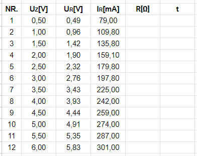

# Author of the solution: Narothe

### Purpose of the exercise:
1. To check Ohm's law.
2. To determine the temperature of the filament of the bulb.

### Course of the exercise:
1. Assemble a circuit consisting of a resistor, an ammeter (200 mA range), and a voltmeter (20 V range).
2. Vary the voltage U (0 - 6 V) and read the intensity I. Make an accurate note of ΔU and ΔI.
3. Change the resistor to an incandescent bulb and carry out analogous measurements.
4. Read the ambient temperature t0.

### Input data:
1. Alpha value:  

2. Ambient temperature:  

3. Resistance of the resistor / bulb:  

### Required physical formulas:
1. Average resistance:  

2. Temperature calculation:  

3. Resistance calculation:  

### Additional formulas:

1. Resistance formula:  

 

Results after testing the resistor Rt = 100 Ω ± 10 Ω 

Where:  
Nr. - ordinal order  
Uz - bulb voltage [V]  
Ur - resistor voltage [V]  
Ir - resistor current [mA]  
R - electrical resistance [Ω]  

## First problem: calculation of resistance

To calculate the resistance you need to use the resistance formula. This formula is given in "additional formulas". Then substitute for the letter "U" the results from the measurements "Ur[V]" and for the letter I the results from the measurements "Ir[mA]". At the very end, we must remember that the results from the measurements of "Ir" are given in "[mA]". This means that we have to multiply the result times 1000 to get the value expressed in "[A]".

 

The calculations are shown in "CALCULATION OF RESISTANCE." After the calculation, we complete the table.

 

Bulb test

Where:  
Nr. - ordinal order  
Uz - bulb voltage [V]  
Ur - resistor voltage [V]  
Ir - resistor current [mA]  
R - electrical resistance [Ω]  
t - temperature [°C]

 

The original text was in Polish. The task was translated using online translators.